# Lumio — Enterprise Commerce & Multi-Department Operations Platform

A high-performance enterprise commerce, fleet telemetry, and operational management ecosystem engineered with **Next.js 14 (App Router)**, **TypeScript**, **Tailwind CSS**, and **MySQL 8.0**. 

Designed with an editorial **Quiet Luxury** aesthetic (natural textures, Egyptian limestone & travertine palettes, Fayoum terracotta accents) and a **Strict Department Isolation Architecture** spanning 12 operational departments.

---

## 🎨 Design & Visual Showcase

### 1. Storefront & Public Experience
*Editorial minimalism with natural materials, typography hierarchy, and quiet luxury aesthetics.*

| Homepage & Hero Experience | Dynamic Autocomplete Search |
| :---: | :---: |
| 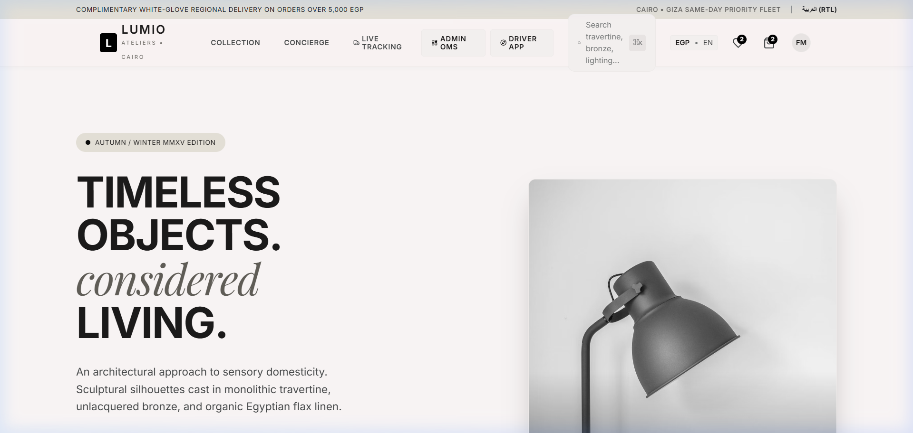 | 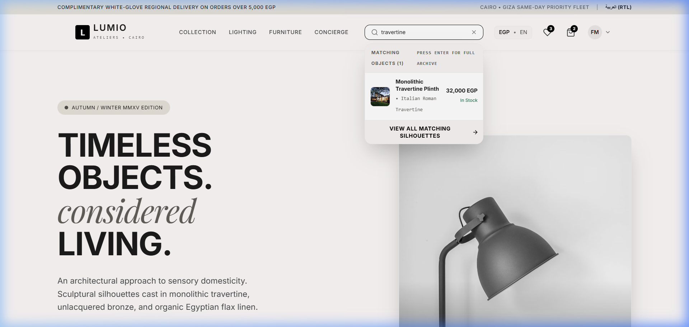 |

| Curated Architectural Collection | Product Detail Page (PDP) & Stock |
| :---: | :---: |
| 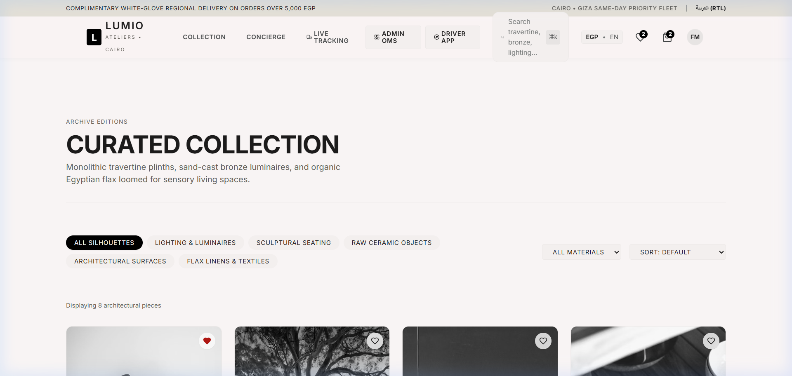 | 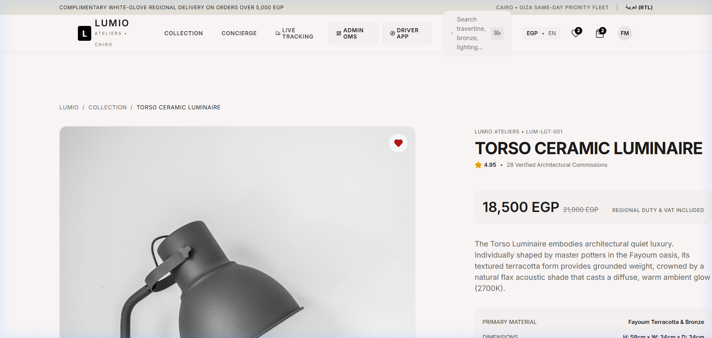 |

---

### 2. Category-Organized Wishlist ("Save for Later") & Clean Navigation
*Saved silhouettes with category filtering pills, 1-click "Add to Cart" drawer, and direct "Buy Now" checkout routing.*

| Clean Public Header (Operations Excluded) | Category Wishlist Studio |
| :---: | :---: |
| 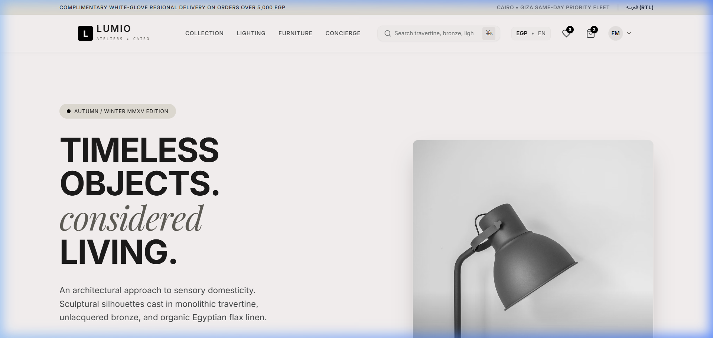 | 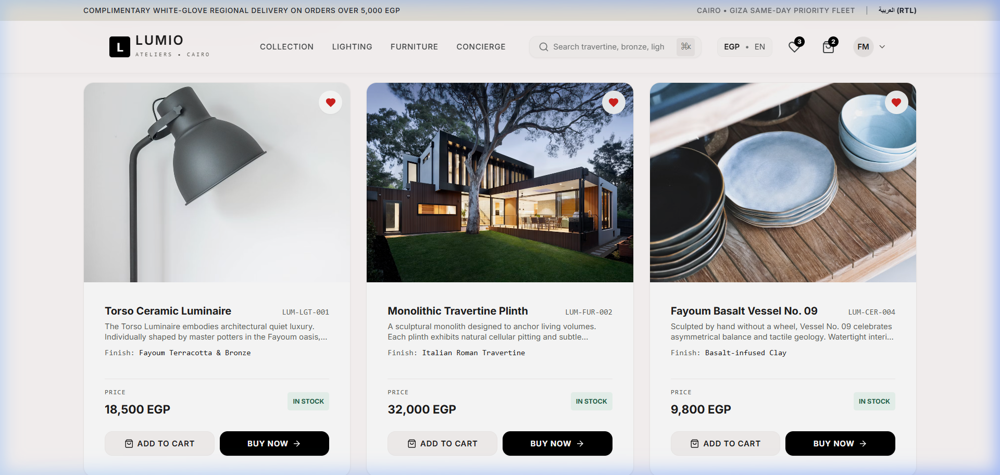 |

---

### 3. Department Isolation & 6-Digit Numeric PIN Authentication
*Strict separation of operations: every department operates under its own isolated URL with a dedicated 6-digit PIN terminal.*

| 6-Digit PIN Keypad Login Gate | Admin Analytics & Operational Control |
| :---: | :---: |
| 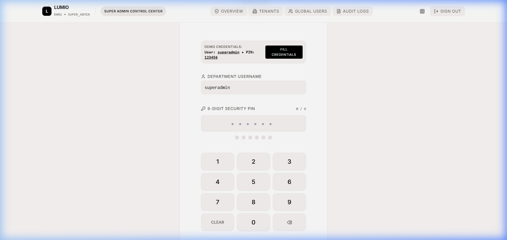 | 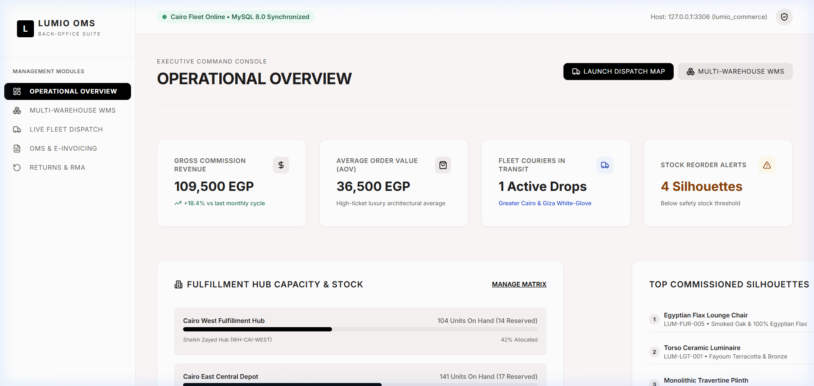 |

---

### 4. Fleet Dispatch Telemetry & Courier Driver Mobile Portal
*White-glove delivery coordination across Greater Cairo with live telemetry, GPS routing, and Proof of Delivery (POD).*

| Real-Time Fleet Dispatch Hub | Courier Driver Mobile Web App |
| :---: | :---: |
| 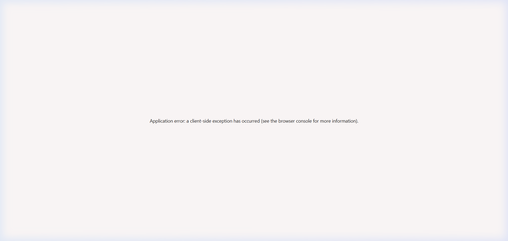 | 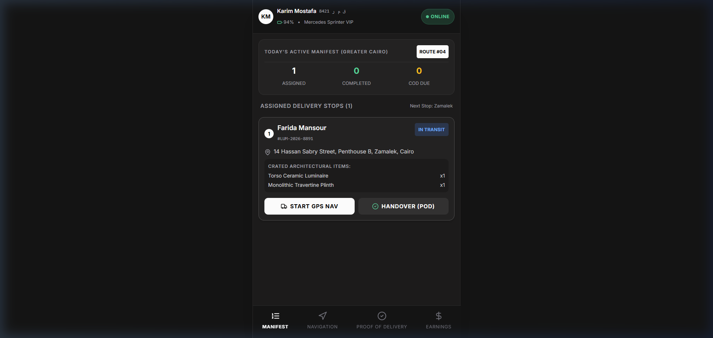 |

| Proof of Delivery (POD) Handover | Live Customer Order GPS Tracking |
| :---: | :---: |
| 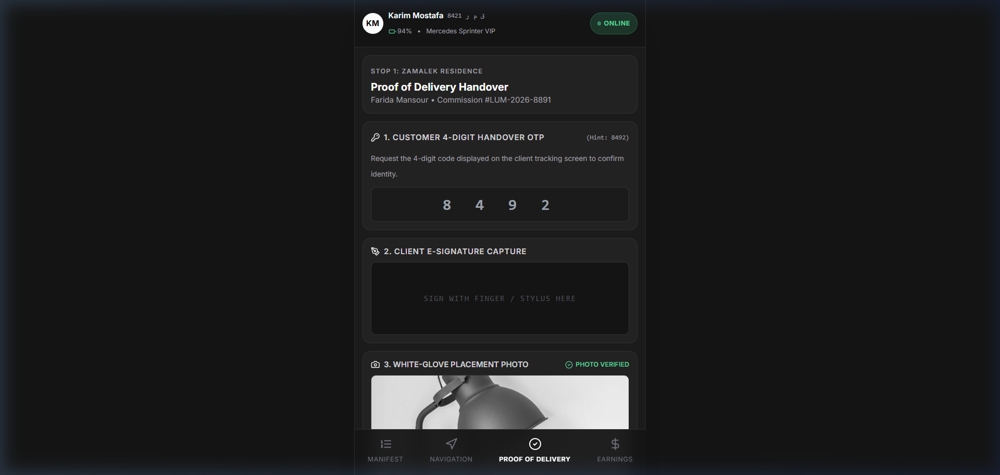 | 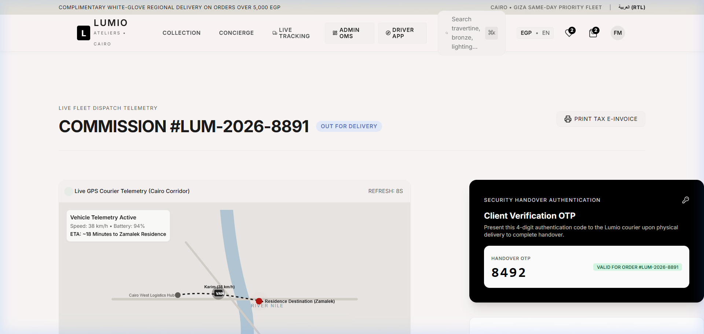 |

---

### 5. Multi-Warehouse Inventory (WMS) & Full Arabic RTL Mode
*Multi-depot stock allocation matrix and native bidirectional Arabic RTL typography.*

| Multi-Warehouse Stock Matrix | Native Arabic (RTL) Luxury Experience |
| :---: | :---: |
| 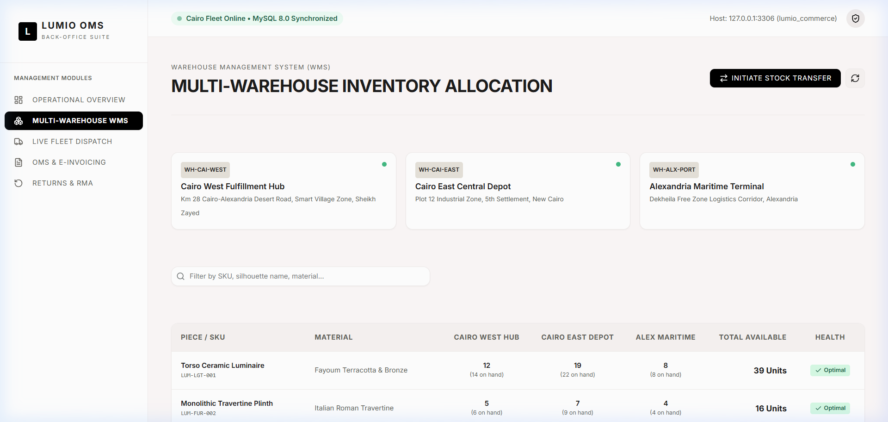 | 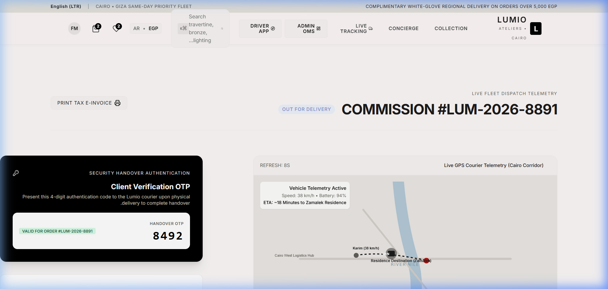 |

---

## 🏛️ 12 Operational Departments & Credentials Matrix

Access the **Central Department Directory** at `/departments` to launch into any isolated department portal:

| Dept ID | Department | Dedicated Login Gate | Operational Routes | Demo Username | 6-Digit PIN |
| :--- | :--- | :--- | :--- | :--- | :--- |
| **D001** | `SUPER_ADMIN` | `/super-admin/login` | `/super-admin/dashboard`, `/super-admin/tenants`, `/super-admin/users`, `/super-admin/audit-logs` | `superadmin` | `123456` |
| **D002** | `STORE_ADMIN` | `/store-admin/login` | `/store-admin/dashboard`, `/store-admin/settings`, `/store-admin/staff` | `storeadmin` | `234567` |
| **D003** | `PRODUCT_MANAGER` | `/product/login` | `/product/dashboard`, `/product/products`, `/product/categories`, `/product/brands` | `productmgr` | `345678` |
| **D004** | `INVENTORY_MANAGER`| `/inventory/login` | `/inventory/dashboard`, `/inventory/products`, `/inventory/transfers` | `inventorymgr` | `456789` |
| **D005** | `WAREHOUSE` | `/warehouse/login` | `/warehouse/dashboard`, `/warehouse/picking`, `/warehouse/packing` | `warehouse1` | `567890` |
| **D006** | `SALES` | `/sales/login` | `/sales/dashboard`, `/sales/orders` | `salesrep` | `678901` |
| **D007** | `CUSTOMER_SUPPORT`| `/support/login` | `/support/dashboard`, `/support/tickets` | `supportrep` | `789012` |
| **D008** | `DELIVERY_MANAGER`| `/delivery-manager/login` | `/delivery-manager/dashboard`, `/delivery-manager/orders`, `/delivery-manager/drivers` | `deliverymgr` | `890123` |
| **D009** | `DRIVER` | `/driver/login` | `/driver/dashboard`, `/driver/deliveries`, `/driver/navigation`, `/driver/pod`, `/driver/earnings` | `driver1` | `901234` |
| **D010** | `ACCOUNTING` | `/accounting/login` | `/accounting/dashboard`, `/accounting/payments`, `/accounting/reports` | `accountant` | `112233` |
| **D011** | `MARKETING` | `/marketing/login` | `/marketing/dashboard`, `/marketing/campaigns`, `/marketing/coupons` | `marketmgr` | `223344` |
| **D012** | `CUSTOMER` | `/customer/login` | `/customer/dashboard`, `/customer/orders`, `/customer/profile` | `client1` | `334455` |

---

## 🔒 Security & Architecture Principles

- **Zero Cross-Department Leakage**: `department.md` rules strictly enforced. No common dashboard or navigation leaks between departments. Super Admin accounts cannot log into Store Admin, and Store Admin cannot access Warehouse pick lists.
- **6-Digit PIN Authentication**: Regex enforcement of `/^\d{6}$/` on `/api/auth/login`. Failed attempts lock after 5 strikes and write to immutable `audit_logs`.
- **HMAC SHA-256 Tokens**: Cryptographically signed session tokens stored in secure HTTP-only cookies.
- **Client Route Guard (`DepartmentShell`)**: Automatically redirects unauthenticated or unauthorized users back to the department login terminal with notification toasts.

---

## 🛠️ Technology Stack

- **Framework**: Next.js 14 (App Router, Server & Client Components)
- **Language**: TypeScript
- **Styling**: Tailwind CSS, CSS Design Tokens (Quiet Luxury System)
- **Database**: MySQL 8.0 (`mysql2/promise`)
- **Authentication**: HMAC-SHA256 Signed Session Tokens, HTTP-only Cookies
- **Icons**: Lucide React
- **Animations & Effects**: Canvas Confetti, CSS Transitions

---

## 🚀 Getting Started

### 1. Prerequisites
- **Node.js**: v18.17.0+ or v20+
- **MySQL Server**: Running on port `3306`

### 2. Database Configuration
Ensure MySQL is active with credentials configured in your environment or database script:
```env
DB_HOST=127.0.0.1
DB_PORT=3306
DB_USER=root
DB_PASSWORD=1234
DB_NAME=lumio_commerce
SESSION_SECRET=lumio_quiet_luxury_department_secret_key_2026
```

### 3. Initialize Database & Seed Departments
Run the automated schema creation and department seeding scripts:
```bash
# 1. Initialize schema and sample catalog
node scripts/init_db.js

# 2. Apply department isolation migration & seed 12 department accounts
node scripts/run_dept_migration.js
```

### 4. Install Dependencies & Run
```bash
# Install dependencies
npm install

# Run development server
npm run dev

# Or build and launch production server
npm run build
npm run start -- -p 3000
```

Open [http://localhost:3000](http://localhost:3000) for the public storefront or [http://localhost:3000/departments](http://localhost:3000/departments) for the Department Operations Directory.

---

## 📂 Directory Structure

```
├── assets/screenshots/          # High-resolution design and UI screenshots
├── scripts/
│   ├── init_db.js               # MySQL schema creation and initial catalog seeding
│   ├── run_dept_migration.js    # Department isolation schema & PIN accounts seed
├── src/
│   ├── app/
│   │   ├── (customer)/          # Public storefront route group
│   │   │   ├── account/         # Client profile, saved addresses, orders
│   │   │   ├── checkout/        # Luxury checkout with saved residence pre-fill
│   │   │   ├── collection/      # Architectural catalog with filters & sorting
│   │   │   ├── concierge/       # Bespoke design consultation request
│   │   │   ├── product/[slug]/  # Product detail page (PDP) & multi-warehouse stock
│   │   │   ├── tracking/[id]/   # Real-time courier GPS tracking
│   │   │   └── wishlist/        # Category-organized "Save for Later" studio
│   │   ├── departments/         # Central 12-Department visual gateway
│   │   ├── super-admin/         # D001: Tenants, Users, Audit Logs
│   │   ├── store-admin/         # D002: Store profile, Settings, Staff
│   │   ├── product/             # D003: Catalog Studio, Categories, Brands
│   │   ├── inventory/           # D004: Multi-warehouse WMS & Transfers
│   │   ├── warehouse/           # D005: Barcode Picking & Crating Station
│   │   ├── sales/               # D006: Client Orders & Quotations
│   │   ├── support/             # D007: Client Concierge & Tickets
│   │   ├── delivery-manager/    # D008: Fleet Dispatch Allocation Queue
│   │   ├── driver/              # D009: Courier Mobile Route HUD & POD
│   │   ├── accounting/          # D010: Ledger, 14% Egyptian VAT, COD
│   │   ├── marketing/           # D011: Campaigns & VIP Promo Coupons
│   │   ├── customer/            # D012: Private Client Dedicated Terminal
│   │   └── api/                 # Next.js route handlers (Auth, Orders, RMA, Dispatch, Products)
│   ├── components/
│   │   ├── DepartmentLogin.tsx  # Luxury 6-digit numeric PIN keypad component
│   │   ├── DepartmentShell.tsx  # Isolated layout shell with department route guard
│   │   ├── Header.tsx           # Upgraded storefront header with dynamic search
│   │   ├── CartDrawer.tsx       # Slide-out shopping bag
│   │   ├── ProductCard.tsx      # Atelier card with quick-add & wishlist toggle
│   │   └── SearchModal.tsx      # Command palette search modal
│   ├── context/
│   │   └── CommerceContext.tsx  # Global cart, wishlist, and address book state
│   └── lib/
│       ├── auth.ts              # Session signing, token verification, cookies
│       ├── db.ts                # MySQL connection pool
│       └── departments.ts       # Department metadata and types
└── package.json
```

---

## 📜 Specifications & Documentation Included
- [recurment.md](./recurment.md): 2,607 lines of enterprise e-commerce requirements and technical constraints.
- [department.md](./department.md): 770 lines of multi-department isolation specifications and security rules.
- [stitch_enterprise_commerce_design_system/](./stitch_enterprise_commerce_design_system/): Design system documentation, code tokens, and mockups.

---

## License
MIT License. Commercial enterprise rights reserved for Lumio Ateliers.
